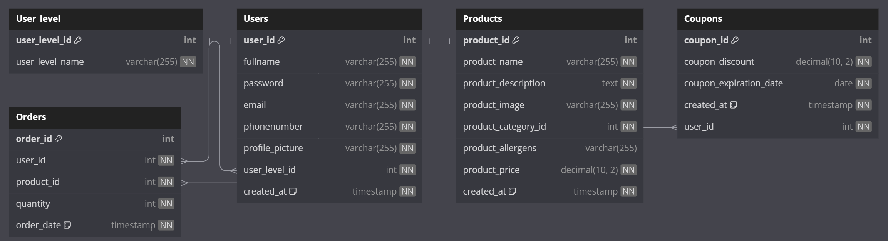

# Herkkutemppeli Database Setup

This repository contains SQL code script to set up a relational database for Herkkutemppeli website.

## Database diagram



## Database Schema

The database consists of the following tables:

1. **User_level:**
   - `user_level_id` (Primary Key, Auto Increment)
   - `user_level_name`

2. **Users:**
   - `user_id` (Primary Key, Auto Increment)
   - `fullname`
   - `password`
   - `email`
   - `phonenumber`
   - `profile_picture`
   - `user_level_id` (Foreign Key)
   - `created_at`

3. **Products:**
   - `product_id` (Primary Key, Auto Increment)
   - `product_name`
   - `product_description`
   - `product_image`
   - `product_category_id`
   - `product_allergens`
   - `product_price`
   - `created_at`

4. **Coupons:**
   - `coupon_id` (Primary Key, Auto Increment)
   - `coupon_discount`
   - `coupon_expiration_date`
   - `created_at`
   - `user_id` (Foreign Key)

5. **Orders:**
   - `order_id` (Primary Key, Auto Increment)
   - `user_id` (Foreign Key)
   - `product_id` (Foreign Key)
   - `quantity`
   - `order_date`

## Insert Data

The code also includes sample mock data inserts for each table to demonstrate how the database works.

### Insert Into Mock Data

```sql
-- insert data
INSERT INTO User_level (user_level_name) 
  VALUES ('User'), ('Admin'), ('Banned');

-- Insert data into Users table
INSERT INTO Users (fullname, password, email, phonenumber, profile_picture, user_level_id)
VALUES
('Eeko', 'testisalis123', 'eemi@metris.fi', '123456789', 'kuvani.jpg', 1),
('KamiKa', 'salistesti123', 'KamiKa@metris.fi', '987654321', 'photo.jpg', 2),
('JamiNa', 'lolitesti555', 'jamina@geemail.fi', '555555555', 'cvphoto.jpg', 2);

-- Insert data into Products table
INSERT INTO Products (product_name, product_description, product_image, product_category_id, product_allergens, product_price)
VALUES
('Bagel', 'Bagel tai Bägel.', 'bagel.jpg', 1, 'Allergen A, Allergen B', 19.99),
('Salaatti', 'Salaatti kanalla tai kalalla.', 'salad.jpg', 2, 'Allergen C', 29.99),
('Juoma', 'Kylmä juoma!', 'drink.jpg', 1, 'No Allergens', 9.99);

-- Insert data into Orders table
INSERT INTO Orders (user_id, product_id, quantity, order_date)
VALUES
(2, 1, 2, '2023-11-10 12:34:56'),
(3, 2, 1, '2023-11-11 09:45:23'),
(2, 3, 3, '2023-11-12 15:22:11');